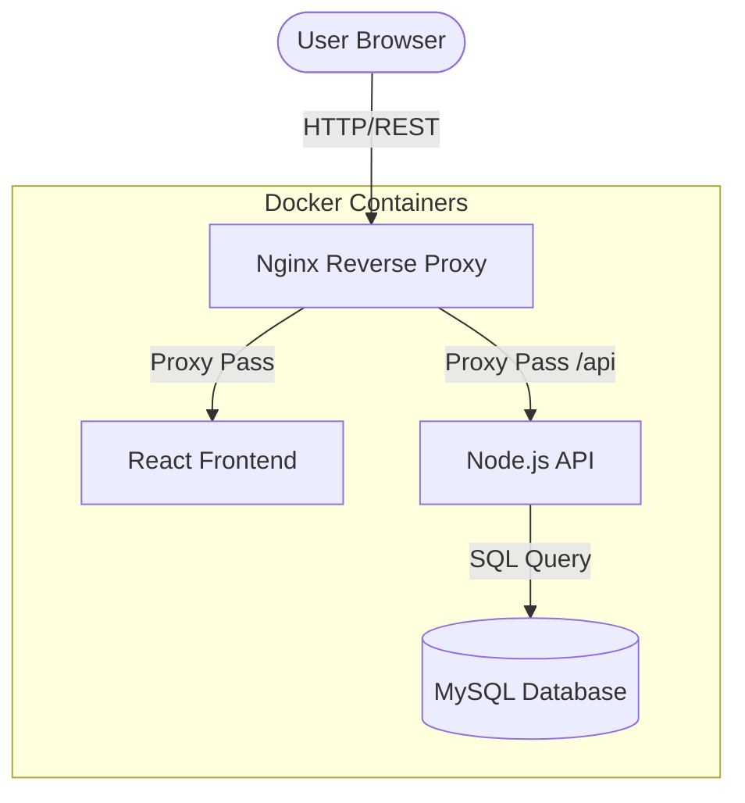

# Expense Tracker - Comprehensive Project Overview

## 1. Project Description
The **Expense Tracker** is a full-stack web application designed to help users manage their finances effectively. It allows users to track their daily transactions, categorize expenses and income, and visualize their financial health through a clean, intuitive dashboard. This project demonstrates a complete DevOps lifecycle including containerization, automated CI/CD, and cloud deployment.

## 2. Key Features
- **Transaction Management**: Add, view, and delete income and expense records.
- **Categorization**: Group transactions into predefined categories (Salary, Food, Shopping, etc.) with visual icons.
- **Dashboard Overview**: Real-time balance calculation and summary of total income and total expenses.
- **Responsive UI**: A modern, mobile-friendly interface built with React and Tailwind CSS.
- **Robust Backend**: RESTful API built with Node.js and Express.
- **Persistent Storage**: Structured data management using MySQL.

## 3. Technology Stack
| Layer | Technology |
|-------|------------|
| **Frontend** | React (Vite), Tailwind CSS, Lucide Icons, Axios |
| **Backend** | Node.js (Express), MySQL2 (Pool), Nodemon |
| **Database** | MySQL 8.0 |
| **Containerization** | Docker, Docker Compose |
| **CI/CD** | GitHub Actions |
| **Cloud Hosting** | AWS EC2 (Ubuntu) |
| **Web Server** | Nginx (Production Reverse Proxy) |

## 4. System Architecture
The application follows a standard three-tier architecture:

### Component Details:
- **Frontend**: Serves the React application. In production, it is built and served via Nginx.
- **Backend API**: Handles business logic and database interactions.
- **Database**: Stores user categories and transaction history.
- **Nginx**: Acts as a gateway, routing requests to the appropriate service and handling CORS.

## 5. Database Schema
The project uses a relational database with the following primary tables:

- **Categories**: `id, name, type (income/expense), icon, color, timestamps`
- **Transactions**: `id, title, amount, type, category_id, date, note, timestamps`

> [!NOTE]
> The database is initialized with `utf8mb4` encoding to support Unicode characters and emojis for category icons.

## 6. Development Workflow
The project leverages Docker for consistent environments:
- **Hot-Reloading**: Enabled in development for both frontend and backend.
- **Volume Mapping**: Local source code is mapped into containers for real-time updates.

---
*Prepared for: College Project Documentation*
